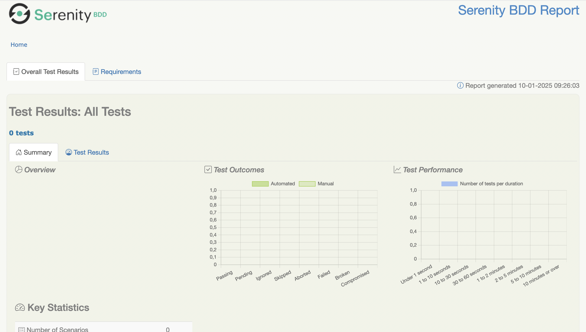

= R5.A.08 -- Dépôt pour les TPs
:icons: font
:MoSCoW: https://fr.wikipedia.org/wiki/M%C3%A9thode_MoSCoW[MoSCoW]

Ce dépôt concerne les rendus de mailto:mael.carrie@etu.univ-tlse2.fr[Mael Carrie].

== TP1

Contenu de is_it_friday_yet.feature

Feature: Est-ce qu'on est vendredi ? tout le monde veut savoir quand c'est vendredi

  Scenario: Dimanche n'est pas vendredi
    Given Aujourd'hui on est "dimanche"
    When Quand on me demande si c'est déjà "vendredi"
    Then Alors je devrait me répondre "Nope"

  Scenario: Vendredi est vendredi
    Given Aujourd'hui on est "vendredi"
    When Quand on me demande si c'est déjà "vendredi"
    Then Alors je devrait me répondre "TGIF"

  Scenario Outline: Vérifier si c'est vendredi
    Given Aujourd'hui on est "<day>"
    When Quand on me demande si c'est déjà "vendredi"
    Then Alors je devrait me répondre "<answer>"

    Examples:
      | day            | answer |
      | vendredi       | TGIF   |
      | dimanche       | Nope   |
      | anything else! | Nope   |

.Code StepDefinitions
[source,java]
---
public class StepDefinitions {
    private String actualDay;
    private String answer;

    @Given("Aujourd'hui on est {string}")
    public void aujourd_hui_on_est_dimanche(String ActualDay) {
        actualDay = ActualDay;
    }

    @When("Quand on me demande si c'est déjà {string}")
    public void quand_je_demande_si_c_est_déjà_vendredi(String Answer) {
        answer = Answer.equals(actualDay) ? "TGIF" : "Nope";
    }

    @Then("Alors je devrait me répondre {string}")
    public void alors_on_devrait_me_répondre(String expectedAnswer) {
        assertEquals(expectedAnswer, answer);
    }
}
---

.Résultat
image::resultatTP1.png[width=80%]

== TP2

Contenu de Order.java

package cucumber_demo2;

import java.util.ArrayList;
import java.util.List;

public class Order {
    private String owner;
    private String target;
    private List<String> cocktails = new ArrayList<>();

    public void declareOwner(String owner) {
        this.owner = owner;
    }

    public void declareTarget(String target) {
        this.target = target;
    }

    public List<String> getCocktails() {
        return cocktails;
    }
}

.Code StepDefinitions
[source,java]
---
public class StepDefinitions {
    private Order order;
    
    @Given("{string} who wants to buy a drink")
    public void romeo_who_wants_to_buy_a_drink(String name) {
        order = new Order();
        order.declareOwner(name);
    }

    @When("an order is declared for {string}")
    public void an_order_is_declared_for_juliette(String targetName) {
        order.declareTarget(targetName);
    }

    @Then("there are {int} cocktails in the order")
    public void there_are_cocktails_in_the_order(int numberOfCocktails) {
        List<String> cocktails = order.getCocktails();
        Assertions.assertEquals(numberOfCocktails, cocktails.size());  // Utilise Assertions de JUnit 5
    }
}

---

.Résultat
image::resultatTP2.png[width=80%]

== TP3

=== Contenu du fichier `ordre_du_jour.feature`

#------------------------------
# Meeting Agenda Validation
#------------------------------
# language: en
Feature: Meeting Agenda Validation
    The agenda of the meeting should follow the expected structure and contain required elements.

Scenario: The agenda should include an introduction of the team
    Given A meeting agenda
    Then The agenda should have a section for team introductions

Scenario: The agenda should cover project goals and context
    Given A meeting agenda
    Then The agenda should have sections for context, objectives, and expected outcomes

Scenario: The agenda should define communication strategies
    Given A meeting agenda
    Then The agenda should specify reporting frequency and communication channels

Scenario: The agenda should allow time for questions
    Given A meeting agenda
    Then The agenda should include a question-and-answer session

=== Implémentation des tests

.Code StepDefinitions
[source,ruby]
----
# -*- coding: utf-8 -*-
# -------------------
# Author::    Mael
# License::   Distributes under the same terms as Ruby
# -------------------
require "rspec/expectations"

Given('A meeting agenda') do
    @ordre_du_jour = "features/resources/Ordre_du_jour_04_09-1.pdf"
end

Then('The agenda should have a section for team introductions') do
  log("Checking for 'Présentation de l’équipe' in #{@ordre_du_jour}")
  expect(system("pdfgrep 'Présentation de l’équipe' #{@ordre_du_jour}")).to be true
end

Then('The agenda should have sections for context, objectives, and expected outcomes') do
  log("Checking for 'Contexte et Objectifs du projet' in #{@ordre_du_jour}")
  expect(system("pdfgrep 'Contexte et Objectifs du projet' #{@ordre_du_jour}")).to be true

  log("Checking for 'Vision Globale' in #{@ordre_du_jour}")
  expect(system("pdfgrep 'Vision Globale' #{@ordre_du_jour}")).to be true

  log("Checking for 'Résultats Attendus' in #{@ordre_du_jour}")
  expect(system("pdfgrep 'Résultats Attendus' #{@ordre_du_jour}")).to be true
end

Then('The agenda should specify reporting frequency and communication channels') do
  log("Checking for 'Périodicité des Rapports' in #{@ordre_du_jour}")
  expect(system("pdfgrep 'Périodicité des Rapports' #{@ordre_du_jour}")).to be true

  log("Checking for 'Canaux de Communication' in #{@ordre_du_jour}")
  expect(system("pdfgrep 'Canaux de Communication' #{@ordre_du_jour}")).to be true
end

Then('The agenda should include a question-and-answer session') do
  log("Checking for 'Questions et Réponses' in #{@ordre_du_jour}")
  expect(system("pdfgrep 'Questions et Réponses' #{@ordre_du_jour}")).to be true
end
----

=== Objectif du TP

L'objectif était de valider qu'un ordre du jour de réunion respecte une structure définie et contient les éléments attendus. J'ai utilisé Cucumber pour décrire les critères de validation sous forme de scénarios, et Ruby pour implémenter les tests.

Les étapes testées dans ce TP incluent :

1. La présence d'une section pour la présentation de l'équipe.
2. La couverture des objectifs et du contexte du projet, ainsi que des résultats attendus.
3. La définition des stratégies de communication, y compris la périodicité des rapports et les canaux de communication.
4. L'inclusion d'une session de questions et réponses dans l'ordre du jour.

Les tests ont été réalisés en utilisant des expressions régulières pour rechercher des sections spécifiques dans le fichier PDF de l'ordre du jour. J'aiutilisé `pdfgrep` pour vérifier la présence des titres de chaque section.

.Résultat

== TP4

=== Documentation réalisé avec cukedoctror sur `hellocucumber`

:toc: right
:backend: html5
:doctitle: Living Documentation
:doctype: book
:icons: font
:!numbered:
:sectanchors:
:sectlink:
:docinfo:
:source-highlighter: highlightjs
:toclevels: 3
:hardbreaks:
:chapter-label: Chapter
:version-label: Version

= *Living Documentation*

== *Summary*
[cols="12*^m", options="header,footer"]
|===
3+|Scenarios 7+|Steps 2+|Features: 1

|[green]#*Passed*#
|[red]#*Failed*#
|Total
|[green]#*Passed*#
|[red]#*Failed*#
|[purple]#*Skipped*#
|[maroon]#*Pending*#
|[yellow]#*Undefined*#
|[blue]#*Missing*#
|Total
|Duration
|Status

12+^|*<<Est-ce-qu'on-est-vendredi-?-tout-le-monde-veut-savoir-quand-c'est-vendredi>>*
|5
|0
|5
|15
|0
|0
|0
|0
|0
|15
|003ms
|[green]#*passed*#
12+^|*Totals*
|5|0|5|15|0|0|0|0|0|15 2+|003ms
|===

== *Features*

[[Est-ce-qu'on-est-vendredi-?-tout-le-monde-veut-savoir-quand-c'est-vendredi, Est-ce qu'on est vendredi ? tout le monde veut savoir quand c'est vendredi]]
=== *Est-ce qu'on est vendredi ? tout le monde veut savoir quand c'est vendredi*

ifndef::backend-pdf[]
minmax::Est-ce-qu'on-est-vendredi-?-tout-le-monde-veut-savoir-quand-c'est-vendredi[]
endif::[]
==== Scenario: Dimanche n'est pas vendredi

==========
Given ::
Aujourd'hui on est "dimanche" icon:thumbs-up[role="green",title="Passed"] [small right]#(001ms)#
When ::
Quand on me demande si c'est déjà "vendredi" icon:thumbs-up[role="green",title="Passed"] [small right]#(000ms)#
Then ::
Alors je devrait me répondre "Nope" icon:thumbs-up[role="green",title="Passed"] [small right]#(001ms)#
==========

==== Scenario: Vendredi est vendredi

==========
Given ::
Aujourd'hui on est "vendredi" icon:thumbs-up[role="green",title="Passed"] [small right]#(000ms)#
When ::
Quand on me demande si c'est déjà "vendredi" icon:thumbs-up[role="green",title="Passed"] [small right]#(000ms)#
Then ::
Alors je devrait me répondre "TGIF" icon:thumbs-up[role="green",title="Passed"] [small right]#(000ms)#
==========

==== Scenario Outline: Vérifier si c'est vendredi

==========
Given ::
Aujourd'hui on est "vendredi" icon:thumbs-up[role="green",title="Passed"] [small right]#(000ms)#
When ::
Quand on me demande si c'est déjà "vendredi" icon:thumbs-up[role="green",title="Passed"] [small right]#(000ms)#
Then ::
Alors je devrait me répondre "TGIF" icon:thumbs-up[role="green",title="Passed"] [small right]#(000ms)#
==========

==== Scenario Outline: Vérifier si c'est vendredi

==========
Given ::
Aujourd'hui on est "dimanche" icon:thumbs-up[role="green",title="Passed"] [small right]#(000ms)#
When ::
Quand on me demande si c'est déjà "vendredi" icon:thumbs-up[role="green",title="Passed"] [small right]#(000ms)#
Then ::
Alors je devrait me répondre "Nope" icon:thumbs-up[role="green",title="Passed"] [small right]#(000ms)#
==========

==== Scenario Outline: Vérifier si c'est vendredi

==========
Given ::
Aujourd'hui on est "anything else!" icon:thumbs-up[role="green",title="Passed"] [small right]#(000ms)#
When ::
Quand on me demande si c'est déjà "vendredi" icon:thumbs-up[role="green",title="Passed"] [small right]#(000ms)#
Then ::
Alors je devrait me répondre "Nope" icon:thumbs-up[role="green",title="Passed"] [small right]#(000ms)#
==========

=== Documentation réalisé avec serenity sur `serenity-junit-screenplay-starter`

=== Documentation réalisé avec serenity sur `hellocucumberSerenity`

J'ai réussi à générer un document à l'aide de 'cukedoctor' pour le TP1 'hellocucumber'. De plus, j'ai pu générer le site web en utilisant Serenity à partir du dépôt fourni dans le TP4. Enfin, j'ai également réussi à créer le site Serenity en réalisant une copie du TP1 'hellocucumber'.